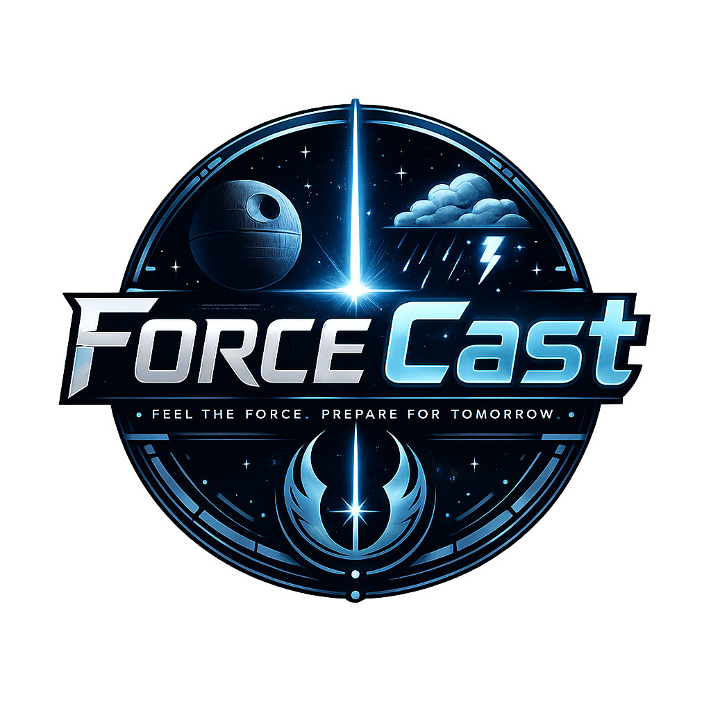
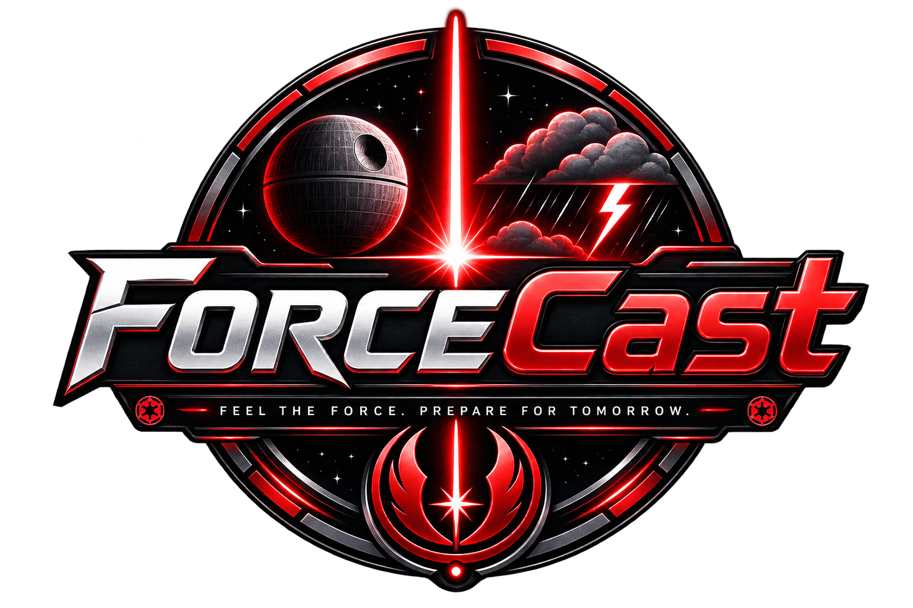

# 🌌 ForceCast — Star Wars Weather App ⚔️

> **May the Force be with your forecast.**

Uma aplicação web interativa de previsão do tempo inspirada no universo de **Star Wars**, combinando dados meteorológicos em tempo real com uma interface futurista de **cockpit espacial e painel holográfico**.

O nome **ForceCast** une *Force* (A Força) + *Forecast* (previsão do tempo), representando a proposta do projeto de transformar uma consulta meteorológica em uma experiência imersiva no universo de Star Wars.

🔗 **[Acessar o ForceCast](https://marypraxedes.github.io/projeto_clima/)**

---

## ✨ Identidade Visual

O ForceCast possui duas identidades visuais baseadas nos lados da Força.

### ☀️ Lado da Luz



Interface inspirada no **Lado da Luz**, com elementos visuais mais claros, atmosfera de Tatooine e temática Jedi.

### 🌑 Lado Sombrio



Interface inspirada no **Lado Sombrio**, com elementos vermelhos, estética Sith e temática de Darth Vader.

---

## 🚀 Funcionalidades

### 📍 Previsão pela Localização Atual

O usuário pode permitir que o navegador acesse sua localização atual para consultar automaticamente as condições meteorológicas da região.

A funcionalidade utiliza a **Geolocation API** do navegador para obter as coordenadas e realizar a consulta meteorológica correspondente.

```text
📍 Localização
      ↓
🌎 Coordenadas
      ↓
☁️ Consulta meteorológica
      ↓
📊 Previsão
```

---

### 🔎 Busca por Cidade

Também é possível pesquisar manualmente uma cidade para consultar sua previsão do tempo.

A aplicação possui tratamento para diferentes situações:

* Busca vazia;
* Cidade não encontrada;
* Erros na comunicação com a API;
* Limitações de requisições;
* Entradas inválidas.

---

### 🌡️ Condições Meteorológicas Atuais

O painel apresenta informações meteorológicas da localização selecionada:

* 🌡️ Temperatura atual;
* 💧 Umidade relativa do ar;
* 💨 Velocidade do vento;
* 🌧️ Precipitação;
* 🕐 Informações relacionadas ao horário local.

---

### 📅 Previsão para os Próximos 3 Dias

Além das condições meteorológicas atuais, o ForceCast apresenta a **previsão dos próximos 3 dias**.

Assim, o usuário consegue acompanhar a evolução do clima e consultar rapidamente as condições previstas para os dias seguintes.

---

## 🌓 Lado da Luz vs. Lado Sombrio

Um dos principais diferenciais do ForceCast é o sistema de temas inspirado nos dois lados da Força.

### ☀️ Lado da Luz

O modo claro apresenta:

* 🏜️ Fundo animado inspirado em Tatooine;
* ⚔️ Acionamento do sabre de luz Jedi;
* 🔊 Sons ambientes de nave/deserto;
* ✨ Interface com elementos luminosos;
* 🌞 Identidade visual própria.

### 🌑 Lado Sombrio

O modo escuro transforma completamente a atmosfera:

* 🖤 Fundo animado inspirado em Darth Vader;
* 🔴 Bordas holográficas vermelhas;
* 🤖 Aparição do Chibi Darth Vader;
* 🎙️ Fala icônica **"I have you now"**;
* 🎵 Trilha sonora de fundo;
* ⚡ Interface inspirada na estética Sith;
* 🌑 Identidade visual própria.

A alternância de tema modifica não apenas as cores, mas também **elementos visuais, animações e recursos sonoros**.

---

## 📺 Interface Holográfica

A interface foi desenvolvida para simular um **painel de controle de uma nave espacial**.

### 📺 Efeito CRT — Scanlines

Linhas de varredura horizontais simulam monitores CRT e equipamentos tecnológicos antigos.

### 💻 Painel de Telemetria

As informações meteorológicas são apresentadas através de cards com efeitos de brilho interno (*inset glow*), criando uma estética de painel holográfico.

### 🎯 Targeting Computer

O cursor do mouse foi estilizado como uma **mira de precisão (*crosshair*)**, inspirada em computadores de targeting militares.

### ⚡ Glitch Effects

Botões e elementos interativos possuem efeitos de *glitch* durante o *hover*, simulando interferências em um sistema holográfico.

---

## 📜 Intro Crawl — Abertura Cinemática

Antes de acessar o painel meteorológico, o usuário passa por uma abertura inspirada no clássico **Star Wars Crawl**.

A introdução possui:

* 🌌 Fundo espacial;
* ⭐ Estrelas;
* 📜 Texto subindo em perspectiva 3D;
* 🎬 Transição cinematográfica;
* 🎵 **Marcha Imperial** como trilha sonora.

A abertura transforma o carregamento inicial em uma experiência cinematográfica antes de liberar o painel do ForceCast.

---

## 🧪 Testes Automatizados

O projeto conta com uma suíte de **testes unitários utilizando Jest**, com mocks das requisições de rede.

Os testes validam diferentes cenários da aplicação, incluindo:

* ✅ Requisições bem-sucedidas;
* ✅ Entradas vazias;
* ✅ Tratamento de erros;
* ✅ Respostas inesperadas;
* ✅ Limitações de requisições;
* ✅ Lógica de consumo da API.

Para executar:

```bash
npm install
npm test
```

---

## 🛠️ Tecnologias Utilizadas

### Frontend

* **HTML5**
* **CSS3**
* **JavaScript Vanilla (ES6+)**

### APIs e Recursos Web

* **Open-Meteo API** — dados meteorológicos;
* **Geolocation API** — localização atual do usuário;
* **Fetch API** — requisições HTTP;
* **Async/Await** — operações assíncronas.

### Testes

* **Jest**
* **Mocks de requisições**

### Recursos Visuais

* CSS Animations;
* CSS Variables;
* CRT / Scanlines;
* Glitch Effects;
* Holographic UI;
* Crosshair Cursor;
* Temas dinâmicos;
* Efeitos sonoros;
* Animações 3D.

---

## 📂 Estrutura do Projeto

```text
projeto_clima/
│
├── audio/
│   ├── imperial_march.mp3
│   └── ...                    # Efeitos sonoros
│
├── css/
│   └── style.css              # Estilos, temas e animações
│
├── images/
│   ├── logo-light.png         # Logo do Lado da Luz
│   ├── logo-dark.png          # Logo do Lado Sombrio
│   └── ...                    # Outras imagens
│
├── js/
│   └── api.js                 # API, localização e lógica
│
├── tests/
│   └── api.test.js            # Testes automatizados
│
├── .gitignore
├── index.html
├── package.json
├── SECURITY.md
├── NOTICE.md
├── LICENSE
└── README.md
```

---

## 💻 Como executar localmente

### 1. Clone o repositório

```bash
git clone https://github.com/marypraxedes/projeto_clima.git
```

### 2. Entre na pasta

```bash
cd projeto_clima
```

### 3. Execute a aplicação

Abra o `index.html` no navegador ou utilize a extensão **Live Server** no Visual Studio Code.

> Para utilizar a funcionalidade de localização atual, o navegador poderá solicitar permissão para acessar sua localização.

---

## 🌐 Deploy

A versão atual do ForceCast está disponível online através do **GitHub Pages**.

🚀 **[Acessar aplicação](https://marypraxedes.github.io/projeto_clima/)**

O fluxo de publicação do projeto segue:

```text
Desenvolvimento
      ↓
Pull Request
      ↓
Testes
      ↓
Code Review
      ↓
Merge → main
      ↓
GitHub Pages
      ↓
ForceCast em produção 🚀
```

---

## 🔒 Privacidade e Segurança

### 📍 Localização

A localização do usuário é utilizada somente para obter as coordenadas necessárias à consulta meteorológica.

A aplicação não mantém permanentemente um histórico de localização ou pesquisas.

### 🔑 API Key

O projeto utiliza a **Open-Meteo API**, que não exige uma chave privada para as requisições realizadas pela aplicação.

### 🛡️ Validação

As entradas fornecidas pelo usuário são validadas antes do processamento para reduzir comportamentos inesperados.

Mais informações podem ser encontradas em [`SECURITY.md`](SECURITY.md).

---

## 📚 Conceitos Praticados

Durante o desenvolvimento do ForceCast foram aplicados conceitos de:

* Manipulação do DOM;
* JavaScript ES6+;
* Consumo de APIs REST;
* `fetch`;
* `async/await`;
* Geolocation API;
* Tratamento de erros;
* Testes unitários;
* Mock de requisições;
* CSS avançado;
* Animações e transições;
* Variáveis CSS;
* Responsividade;
* Controle de temas;
* Manipulação de áudio;
* Git e GitHub;
* Deploy com GitHub Pages.

---

## 🎯 Objetivo do Projeto

O ForceCast foi desenvolvido como projeto prático do **Bootcamp da Generation Brasil**, com o objetivo de aplicar conhecimentos de desenvolvimento web, integração com APIs e testes automatizados.

Além da funcionalidade de previsão do tempo, o projeto explora a criação de uma **experiência de usuário imersiva**, combinando desenvolvimento frontend, APIs, geolocalização, animações, áudio e uma identidade visual inspirada em Star Wars.

---

## 👩‍💻 Desenvolvido por

**Maryane Praxedes**

Estudante de Engenharia de Software e desenvolvedora em formação.

🐙 [GitHub — @marypraxedes](https://github.com/marypraxedes)

---

## ⭐ Gostou do projeto?

Se você gostou do ForceCast, considere deixar uma ⭐ no repositório!

> **May the Force be with your forecast.** ⚔️🌌
